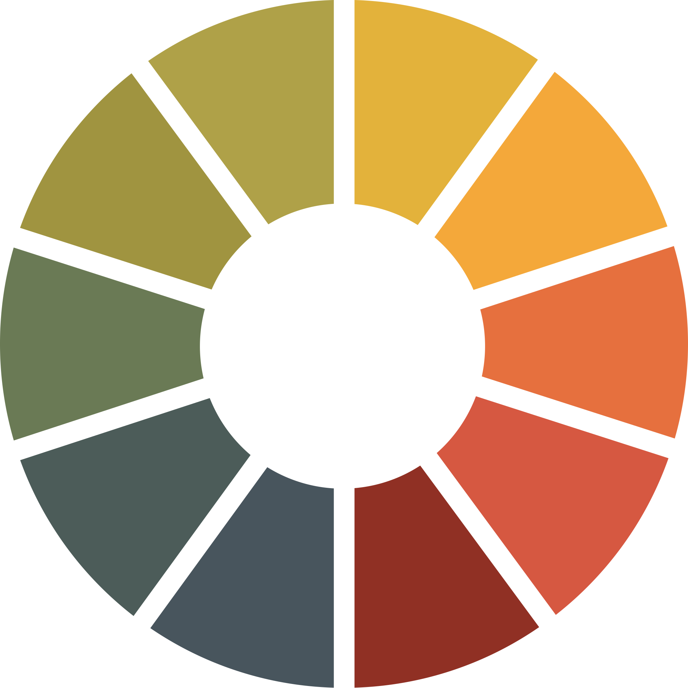
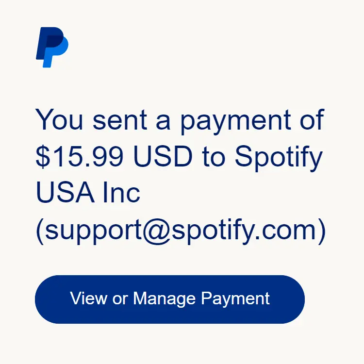
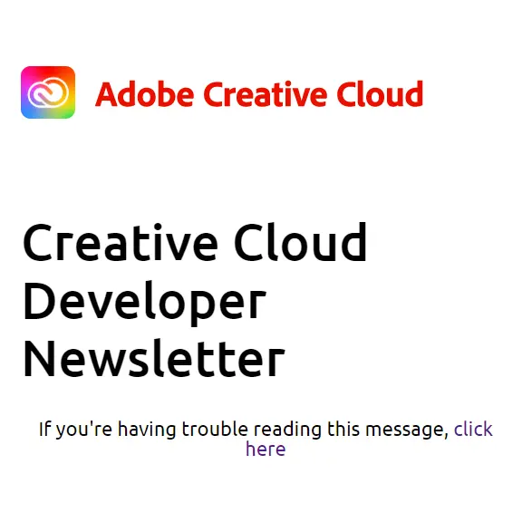

<!-- ABOUT ME -->

  

<h2 align="center">Hi 👋, I'm Adam Doty</h2>
<h3 align="center">HTML Email Developer & Content Editor</h3>
<h4 align="left">
  I'm a passionate Web Developer focused on email marketing and content
  management. You'll find I'm eager to learn, deeply care about doing quality
  work, and helping provide value. I pride myself on doing a great job in a
  timely manner, happily taking on challenges and leveraging them into skills
  that further my ability to assist. In my spare time, you'll find me with my
  lovely wife and cat. I often cook pizza and enjoy a rousing game of Catan!
</h4>

<!-- SKILLS -->

<h2 align="center">Skills</h2>

   
  

    <table align="center">
      <tr>
        <td width="16.66%">
          

            
          

          
Mailchimp

        </td>
        <td width="16.66%">
          

            
          

          
Litmus

        </td>
        <td width="16.66%">
          

            
          

          
WordPress

        </td>
        <td width="16.66%">
          

            
          

          
HTML

        </td>
        <td width="16.66%">
          

            
          

          
MJML

        </td>
        <td width="16.66%">
          

            
          

          
JavaScript

        </td>
      </tr>
      <tr>
        <td width="16.66%">
          

            
          

          
CSS

        </td>
        <td width="16.66%">
          

            
          

          
SASS

        </td>
        <td width="16.66%">
          

            
          

          
Git

        </td>
        <td width="16.66%">
          

            
          

          
GitHub

        </td>
        <td width="16.66%">
          

            
          

          
Figma

        </td>
        <td width="16.66%">
          

            
          

          
Photoshop

        </td>
      </tr>
    </table>
  

 

<!-- PROJECTS -->

<h2 align="center">Projects</h2>

  <table>
    <tr>
      <td width="50%">
        

          <h3 align="center">Promotional Email</h3>
          
           
           
          

            
            
          

          
<strong>HTML, SCSS, Javascript</strong>

          

            A promotional Headspace email advertising 20% off Headspace for
            Mother's Day. I used Foundation for Emails framework with this
            project.
          

           
        

      </td>
      <td width="50%">
        

          <h3 align="center">Transactional Email</h3>
          
           
           
          

            
            
          

          
<strong>HTML, MJML</strong>

          

            A transactional email from PayPal for my subscription to Spotify. I
            used MJML to quickly piece this email together, allowing me to focus
            on the small details instead of how to properly nest html tables
            within each other.
          

        

      </td>
    </tr>
    <tr>
      <td width="50%">
        

          <h3 align="center">Newsletter Email</h3>
          
           
           
          

            
            
          

          
<strong>HTML, MJML</strong>

          

            A developer newsletter from Adobe Creative Cloud announcing Adobe
            Express Developer Add-ons and Partner Days. I leveraged Mailjet's
            Markup Language (MJML) to make this newsletter responsive and
            modular.
          

        

      </td>
      <td width="50%"></td>
    </tr>
  </table>

 
 

<!-- SOCIALS -->

<h2 align="center">Contact Me</h2>

  <table>
    <row>
      <td width="100px" height="80px">
        <a href="https://github.com/adamdoty" target="blank">
          

            
          

          <strong>
            
GitHub

          </strong>
        </a>
      </td>
      <td width="100px" height="80px">
        <a href="https://twitter.com/doty_codes" target="blank">
          

            
          

          <strong>
            
Twitter

          </strong>
        </a>
      </td>
      <td width="100px" height="80px">
        <a href="https://www.instagram.com/doty_codes/" target="blank">
          

            
          

          <strong>
            
Instagram

          </strong>
        </a>
      </td>
      <td width="100px" height="80px">
        <a href="https://www.linkedin.com/in/adam-c-doty/" target="blank">
          

            
          

          <strong>
            
LinkedIn

          </strong>
        </a>
      </td>
    </row>
  </table>

<!-- STATS -->

<!-- FOOTER -->

  

    Icons by
    <a href="https://icons8.com">Icons8</a>
  

  
Adam Doty &copy; 2023 - All Rights Reserved

